# Gen-L-Video: Long Video Generation via Temporal Co-Denoising


This repository is the official implementation of [Gen-L-Video](https://arxiv.org/abs/2305.18264).

**[Gen-L-Video: Multi-Text Conditioned Long Video Generation via Temporal Co-Denoising](https://arxiv.org/abs/2305.18264)** <br/>
[Fu-Yun Wang](https://g-u-n.github.io), [Wenshuo Chen](https://winshot-thu.github.io/), [Guanglu Song](https://songguanglu.github.io/), [Han-Jia Ye](https://www.lamda.nju.edu.cn/yehj/), [Yu Liu](https://liuyu.us), [Hongsheng Li](https://www.ee.cuhk.edu.hk/~hsli/) <br/>

[](https://g-u-n.github.io/projects/gen-long-video/index.html) [](https://arxiv.org/abs/2305.18264) [](https://colab.research.google.com/drive/1bWROxCbt7XFHTiz5G8T4ILZBtMjtOpDn?usp=sharing)


---
<p align="center">

</p>
<p align="center">
  <a href="#Introduction">Introduction</a> •
  <a href="#Comparisons">Comparisons</a> •  
  <a href="#Setup">Setup</a> •
  <a href="#Results">Results</a> •  
   <a href="#Relevant-Works">Relevant Works</a> •   
   <a href="#Acknowledgments">Acknowledgments</a> •
  <a href="#Citation">Citation</a> •
  <a href="#Contact">Contact</a>
</p>

## Introduction

🔥🔥 **TL;DR:** **A** <font color=#FF2000> ***universal***</font>  **methodology that extends short video diffusion models for efficient** <font color=#FF2000>***multi-text conditioned long video***</font>  **generation and editing.**

Current methodologies for video generation and editing, while innovative, are often confined to extremely short videos (typically **less than 24 frames**) and are **limited to a single text condition**. These constraints significantly limit their applications given that real-world videos usually consist of multiple segments, each bearing different semantic information. To address this challenge, we introduce a novel paradigm dubbed as ***Gen-L-Video*** capable of extending off-the-shelf short video diffusion models for generating and editing videos comprising **hundreds of frames** with **diverse semantic segments** ***without introducing additional training, all while preserving content consistency***.

<p align="center">
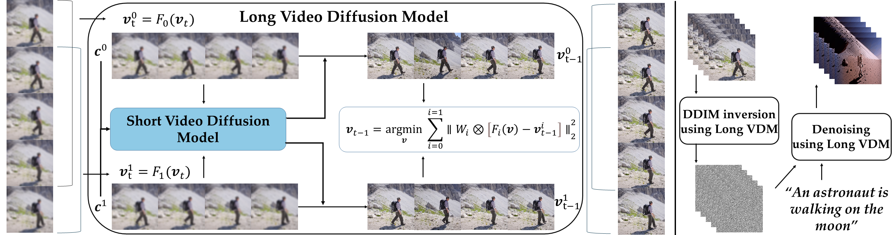  
<br>
<em>Essentially, this procedure establishes an abstract long video generator and editor without necessitating any additional training, enabling the generation and editing of videos of any length using established short video generation and editing methodologies.</em>
</p>

## News

- **[2023.05.30]**: Our paper is now available on [arXiv](https://arxiv.org/abs/2305.18264). 
- **[2023.05.30]**: Our project page is now available on [gen-long-video](https://g-u-n.github.io/projects/gen-long-video/index.html).
- **[2023.06.01]**: Basic code framework is now open-sourced [GLV](https://github.com/G-U-N/Gen-L-Video).
- **[2023.06.01]**: Scripts: [one-shot-tuning](https://github.com/G-U-N/Gen-L-Video/blob/master/one-shot-tuning.py), [tuning-free-mix](https://github.com/G-U-N/Gen-L-Video/blob/master/tuning-free-mix.py), [tuning-free-inpaint](https://github.com/G-U-N/Gen-L-Video/blob/master/tuning-free-inpaint.py) is now available. 
- **[2023.06.02]**: Scripts for preparing control videos including `canny`, `hough`, `hed`, `scribble`,`fake_scribble`, `pose`, `seg`, `depth`, and `normal` is now available, following the [instruction](https://github.com/G-U-N/Gen-L-Video#get-your-own-control-videos) to get your own control videos.
- **[2023.06.04]**: We now support very long Pose-to-Video generation with pretrained [Follow-Your-Pose](https://github.com/mayuelala/FollowYourPose) and extend it to multi-text conditioned without introducing higher computation or VRAM requirements. 
- **[2023.06.04]**: [Colab demo](https://colab.research.google.com/drive/1bWROxCbt7XFHTiz5G8T4ILZBtMjtOpDn?usp=sharing) released!
- **[2023.06.09]**: We now support Video2Video generation (inspired by the image2image transition), capable of generating very realistic long videos of faces.  

🤗🤗🤗More training/inference scripts will be available in a few days.

## Setup

#### Clone the Repo
```shell
git clone https://github.com/G-U-N/Gen-L-Video
cd Gen-L-Video
# The repo might be too large to clone because many long gifs are over 100 M. Fork the repo, delete the statics, and then clone it. 
```

#### Install Environment via Anaconda

```shell
conda env create -f requirements.yml
conda activate glv
conda install pytorch==1.13.1 torchvision==0.14.1 torchaudio==0.13.1 pytorch-cuda=11.6 -c pytorch -c nvidia
```

### Install [Xformers](https://github.com/facebookresearch/xformers)
```shell
# (Optional) Makes the build much faster
pip install ninja
# Set TORCH_CUDA_ARCH_LIST if running and building on different GPU types
pip install -v -U git+https://github.com/facebookresearch/xformers.git@main#egg=xformers
# (this can take dozens of minutes)
```


### Install [SAM](https://github.com/facebookresearch/segment-anything) and [Grounding DINO](https://github.com/IDEA-Research/GroundingDINO)

```SHELL
pip install git+https://github.com/facebookresearch/segment-anything.git
pip install git+https://github.com/IDEA-Research/GroundingDINO.git
```

or 

```shell
git clone https://github.com/facebookresearch/segment-anything.git
cd segment-anything
pip install -e .
cd ..
# If you have a CUDA environment, please make sure the environment variable CUDA_HOME is set. 
# If the cuda version of the system conflicts with the cudatoolkit version, See: https://github.com/G-U-N/Gen-L-Video/discussions/7
git clone https://github.com/IDEA-Research/GroundingDINO.git
cd GroundingDINO
pip install -e .
```

Note that if you are using GPU clusters that the management node has no access to GPU resources, you should submit the `pip install -e . ` to the computing node as a computing task when building the GroundingDINO. Otherwise, it will not support detection computing through GPU.

#### Download Pretrained Weights
Make sure git-lfs is available. See: https://github.com/git-lfs/git-lfs/blob/main/INSTALLING.md

```shell
bash scripts/download_pretrained_models.sh
```

After downloading them, you should specify the absolute/relative path of them in the config files.


If you download all the above pretrained weights in the folder `weights` , set the configs files as follows:
1. In `configs/tuning-free-inpaint/girl-glass.yaml`
```yaml
sam_checkpoint: "weights/sam_vit_h_4b8939.pth"
groundingdino_checkpoint: "weights/groundingdino_swinb_cogcoor.pth"
controlnet_path: "weights/edit-anything-v0-3"
```
2. In `one-shot-tuning.py`, set
```python
adapter_paths={
    "pose":"weights/T2I-Adapter/models/t2iadapter_openpose_sd14v1.pth",
    "sketch":"weights/T2I-Adapter/models/t2iadapter_sketch_sd14v1.pth",
    "seg": "weights/T2I-Adapter/models/t2iadapter_seg_sd14v1.pth",
    "depth":"weights/T2I-Adapter/models/t2iadapter_depth_sd14v1.pth",
    "canny":"weights/T2I-Adapter/models/t2iadapter_canny_sd14v1.pth"
}
```
3. In `configs/one-shot-tuning/hike.yaml`, set
```yaml
pretrained_model_path: "weights/anything-v4.0"
```

Then all the other weights are able to be automatically downloaded through the API of Hugging Face.

#### For users who are unable to download weights automatically

Here is an additional instruction for installing and running grounding dino.

```shell
# Notice: If you use 'pip install git+https://github.com/IDEA-Research/GroundingDINO.git'
# You should modify GroundingDINO_SwinB_cfg.py in python site-packages directory
# e.g. ~/miniconda3/envs/glv/lib/python3.8/site-packages/groundingdino/config/GroundingDINO_SwinB_cfg.py
cd GroundingDINO/groundingdino/config/ 
vim GroundingDINO_SwinB_cfg.py
```

set

```py
text_encoder_type = "[Your Path]/bert-base-uncased"
```

Then 

```shell
vim GroundingDINO/groundingdino/util/get_tokenlizer.py
```

Set

```python
def get_pretrained_language_model(text_encoder_type):
    if text_encoder_type == "bert-base-uncased" or text_encoder_type.split("/")[-1]=="bert-base-uncased":
        return BertModel.from_pretrained(text_encoder_type)
    if text_encoder_type == "roberta-base":
        return RobertaModel.from_pretrained(text_encoder_type)
    raise ValueError("Unknown text_encoder_type {}".format(text_encoder_type))
```

Now you should be able to run your Grounding DINO with pre-downloaded bert weights. 

#### Get your own control videos

 ```shell
 git clone https://github.com/lllyasviel/ControlNet.git
 cd ControlNet
 git checkout f4748e3
 mv ../process_data.py .
 python process_data.py --v_path=../data --t_path=../t_data --c_path=../c_data --fps=10
 ```


## Inference

1. One-Shot Tuning Method

```shell
accelerate launch one-shot-tuning.py --control=[your control]
```

`[your control]` can be set as `pose` , `depth`, `seg`, `sketch`, `canny`.  

`pose` and `depth` are recommended.

2. Tuning-Free Method for videos with smooth semantic changes.

 ```shell
 accelerate launch tuning-free-mix.py
 ```

3. Tuning-Free Edit Anything in Videos. 

```shell
accelerate launch tuning-free-inpaint.py
```
4. Long video generation with pretrained. 

```shell
accelerate launch follow-your-pose-long.py
```

5. Tuning-Free Long Video2Video generation

```shell
# canny 
accelerate launch tuning-free-control.py --config=./configs/tuning-free-control/girl-glass.yaml 
# hed
accelerate launch tuning-free-control.py --config=./configs/tuning-free-control/girl.yaml
```

## Comparisons

<table class="center">
<tr>
  <td>Method</td>
  <td>Long Video</td>
  <td>Multi-Text Conditioned</td>              
  <td>Pretraining-Free</td>
  <td>Parallel Denoising</td>
  <td>Versatile</td>
</tr>
    <tr>
  <td>Tune-A-Video</td>
  <td>❌</td>
  <td>❌</td>              
  <td>✔</td>
  <td>❌</td>
  <td>❌</td>
</tr>
    <tr>
  <td>LVDM</td>
  <td>✔</td>
  <td>❌</td>              
  <td>❌</td>
  <td>❌</td>
  <td>❌</td>
</tr>
   <tr>
  <td>NUWA-XL</td>
  <td>✔</td>
  <td>✔</td>              
  <td>❌</td>
  <td>✔</td>
  <td>❌</td>
</tr>
   <tr>
  <td>Gen-L-Video</td>
  <td>✔</td>
  <td>✔</td>              
  <td>✔</td>
  <td>✔</td>
  <td>✔</td>
</tr>
</table>

## Results

Most of the results can be generated with a single RTX 3090.

#### Multi-Text Conditioned Long Video Generation


https://github.com/G-U-N/Gen-L-Video/assets/60997859/9b370894-708a-4ed2-a2ac-abfa93829ea6


This video containing clips bearing various semantic information. 


#### Long Video with Smooth Semantic Changes

All the following videos are directly generated with the pretrained Stable Diffusion weight without additional training.

<table class="center">
<tr>
  <td style="text-align:center;" colspan="4"><b>Videos with Smooth Semantic Changes</b></td>
</tr>
<tr>
  <td></td>
  <td></td>
  <td></td>   
    <td>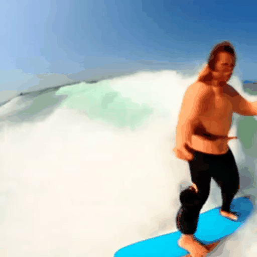</td>   
</tr>
<tr>
  <td width=25% style="text-align:center;">"A man is boating, village." → "A man is walking by, city, sunset."</td>
  <td width=25% style="text-align:center;">"A jeep car is running on the beach, sunny.” → "a jeep car is running on the beach, night."</td>
  <td width=25% style="text-align:center;">"Lion, Grass, Rainy." → "Cat, Grass, Sun." </td>
    <td width=25% style="text-align:center;">"A man is skiing in the sea." → "A man is surfing in the snow."</td>
</tr>
</table>

#### Edit Anything in Video

All the following videos are directly generated with the pretrained Stable Diffusion weight without additional training.

<table class="center">
<tr>
  <td style="text-align:center;" colspan="4"><b>Edit Anything in Videos</b></td>
</tr>
<tr>
  <td></td>
  <td>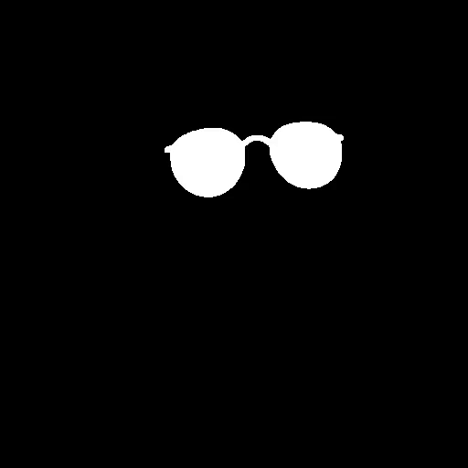</td>
  <td></td>   
    <td></td>   
</tr>
<tr>
  <td width=25% style="text-align:center;">Source Video</td>
  <td width=25% style="text-align:center;">Mask of Sunglasses</td>
  <td width=25% style="text-align:center;">"Sunglasses" → "Pink Sunglasses" </td>
    <td width=25% style="text-align:center;">"Sunglasses" → "Cyberpunk Sunglasses with Neon Lights"</td>
</tr>
<tr>
  <td></td>
  <td></td>
  <td>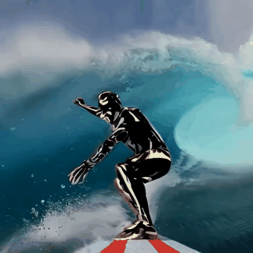</td>   
    <td>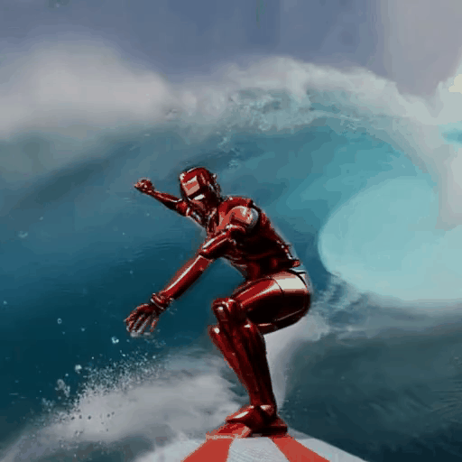</td>   
</tr>
<tr>
  <td width=25% style="text-align:center;">Source Video</td>
  <td width=25% style="text-align:center;">Mask of Man</td>
  <td width=25% style="text-align:center;">"Man" → "Bat Man" </td>
    <td width=25% style="text-align:center;">"Man" → "Iron Man"</td>
</tr>
</table>

#### Controllable Video

<table class="center">
<tr>
  <td style="text-align:center;" colspan="4"><b>Controllable Video</b></td>
</tr>
<tr>
  <td>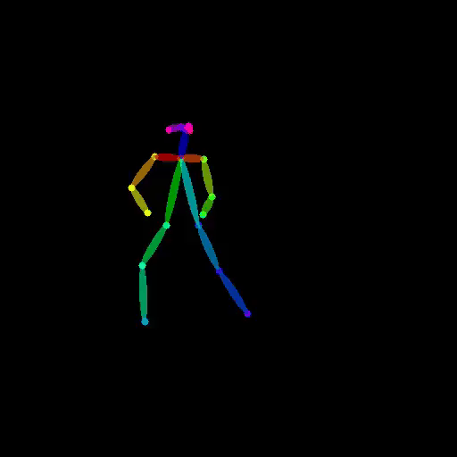</td>
  <td>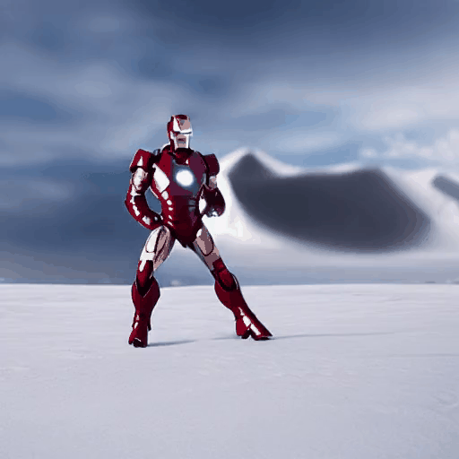</td>
  <td>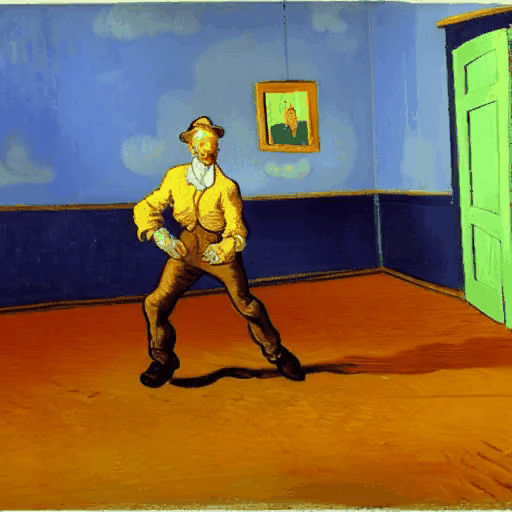</td>   
    <td></td>   
</tr>
<tr>
  <td width=25% style="text-align:center;">Pose Control</td>
  <td width=25% style="text-align:center;">"Iron Man is fighting in the snow."</td>
  <td width=25% style="text-align:center;">"A Van Gogh style painting of a man dancing."</td>
    <td width=25% style="text-align:center;">"A man is running in the fire."</td>
</tr>
<tr>
  <td></td>
  <td>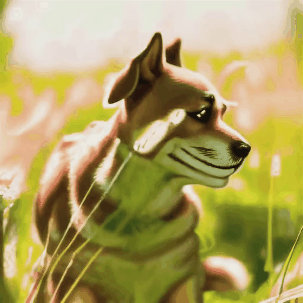</td>
  <td>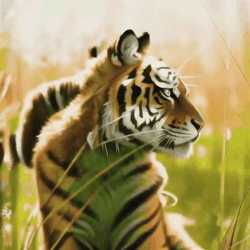</td>   
    <td></td>   
</tr>
<tr>
  <td width=25% style="text-align:center;">Depth Control</td>
  <td width=25% style="text-align:center;">"Dog in the sun.""</td>
  <td width=25% style="text-align:center;">"Tiger in the sun."</td>
    <td width=25% style="text-align:center;">"Girl in the sun."</td>
</tr>
</table>
#### Tuning-Free Long Video-to-Video Generation

<table class="center">
<tr>
  <td style="text-align:center;" colspan="2"><b>Tuning-Free Long Video-to-Video Generation</b></td>
</tr>
<tr>
  <td></td>  
    <td></td>   
</tr>
<tr>
  <td width=50% style="text-align:center;"> "Girls."</td>
  <td width=50% style="text-align:center;"> "Girls wearing sunglasses."</td>
</tr>
</table>

#### Long Video Generation with Pretrained Short Text-to-Video Diffusion Model

All the following videos are directly generated with the pre-trained VideoCrafter without additional training. 

<table class="center">
<tr>
  <td style="text-align:center;" colspan="4"><b>Long Video Generation with Pretrained Short Text-to-Video Diffusion Model</b></td>
</tr>
<tr>
  <td>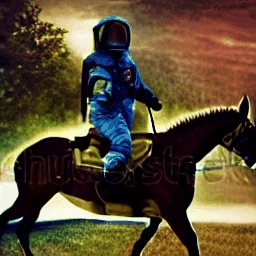</td>
  <td>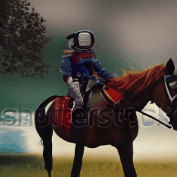</td>
  <td>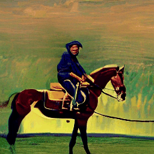</td>   
    <td>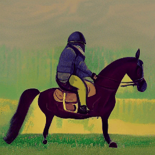</td>   
</tr>
<tr>
  <td width=25% style="text-align:center;"> "Astronaut riding a horse." (Isolated)</td>
  <td width=25% style="text-align:center;">"Astronaut riding a horse." (Gen-L-Video)</td>
  <td width=25% style="text-align:center;">"Astronaut riding a horse, Loving Vincent Style." (Isolated)</td>
    <td width=25% style="text-align:center;">"Astronaut riding a horse, Loving Vincent Style." (Gen-L-Video)</td>
</tr>
<tr>
  <td>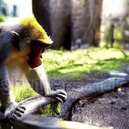</td>
  <td>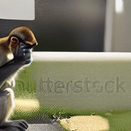</td>
  <td></td>   
    <td>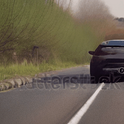</td>   
</tr>
<tr>
  <td width=25% style="text-align:center;">"A monkey is drinking water." (Isolated)</td>
  <td width=25% style="text-align:center;">"A monkey is drinking water." (Gen-L-Video)</td>
  <td width=25% style="text-align:center;">"A car is moving on the road." (Isolated)</td>
    <td width=25% style="text-align:center;">"A car is moving on the road." (Gen-L-Video)</td>
</tr>
</table>


#### Follow-Your-Pose: Long Video Generation with Pretrained Pose-to-Video

The original generated videos (gifs) are over 100 MB, we compress them to upload them to GitHub.

<table class="center">
<tr>
  <td style="text-align:center;" colspan="2"><b>Long Video Generation with Pretrained Pose-to-Video</b></td>
</tr>
<tr>
  <td></td>  
    <td></td>   
</tr>
<tr>
  <td width=50% style="text-align:center;"> "Astronaut in the beach."</td>
  <td width=50% style="text-align:center;">"Astronaut in the beach."</td>
</tr>
<tr>
  <td></td>
  <td></td>
</tr>
<tr>
  <td width=50% style="text-align:center;">"Hulk in the sea."</td>
  <td width=50% style="text-align:center;">"Stormtroopers in the beach."</td>
</tr>
</table>
#### Additional Results

<table class="center">
<tr>
  <td style="text-align:center;" colspan="1"><b>Additional Results</b></td>
</tr>
<tr>
  <td></td> 
</tr>
<tr>
  <td></td> 
</tr>
<tr>
  <td width=100% style="text-align:center;"> </td>
    </tr>
<tr>
  <td></td> 
</tr>
<tr>
  <td></td> 
</tr>
<tr>
  <td></td> 
</tr>
<tr>
  <td></td> 
</tr>
</table>

## Relevant Works
`Tune-A-Video`: One-Shot Tuning of Image Diffusion Models for Text-to-Video Generation. [[paper](https://arxiv.org/abs/2212.11565)] [[code](https://github.com/showlab/Tune-A-Video)]

`Fate-Zero`: Fusing Attentions for Zero-shot Text-based Video Editing. [[paper](https://arxiv.org/abs/2303.09535)] [[code](https://github.com/ChenyangQiQi/FateZero)]

`Pix2Video`: Video Editing using Image Diffusion. [[paper](https://arxiv.org/abs/2303.12688)] [[code](https://github.com/G-U-N/Pix2Video.pytorch)]

`VideoCrafter`: A Toolkit for Text-to-Video Generation and Editing. [[paper](https://arxiv.org/abs/2211.13221)] [[code](https://github.com/VideoCrafter/VideoCrafter)] 

`ControlVideo`: Training-free Controllable Text-to-Video Generation. [[paper](https://arxiv.org/abs/2305.13077)] [[code](https://github.com/YBYBZhang/ControlVideo)]

`Text2Video-Zero`: Text-to-Image Diffusion Models are Zero-Shot Video Generators. [[paper](https://arxiv.org/abs/2303.13439)] [[code](https://github.com/Picsart-AI-Research/Text2Video-Zero)]

Other relevant works about video generation/editing can be obtained by this repo: [Awesome-Video-Diffusion](https://github.com/showlab/Awesome-Video-Diffusion).

## Acknowledgments

- This code is heavily built upon [diffusers](https://github.com/huggingface/diffusers) and [Tune-A-Video](https://github.com/showlab/Tune-A-Video). If you use this code in your research, please also acknowledge their work.
- This project leverages [Stable-Diffusion](https://github.com/CompVis/stable-diffusion),[Stable-Diffusion-Inpaint](https://huggingface.co/runwayml/stable-diffusion-inpainting), [Stable-Diffusion-Depth](https://huggingface.co/runwayml/stable-diffusion-inpainting) , [LoRA](https://github.com/cloneofsimo/lora), [CLIP](https://github.com/openai/CLIP), [VideoCrafter](https://github.com/VideoCrafter/VideoCrafter), [ControlNet](https://github.com/lllyasviel/ControlNet), [T2I-Adapter](https://github.com/TencentARC/T2I-Adapter), [GroundingDINO](https://github.com/IDEA-Research/GroundingDINO),[Edit-Anything](https://github.com/sail-sg/EditAnything) and [Segment Anything](https://github.com/facebookresearch/segment-anything). We thank them for open-sourcing the code and pre-trained models.

## Citation

If you use any content of this repo for your work, please cite the following bib entry:
```bibtex
@article{wang2023gen,
  title={Gen-L-Video: Multi-Text to Long Video Generation via Temporal Co-Denoising},
  author={Wang, Fu-Yun and Chen, Wenshuo and Song, Guanglu and Ye, Han-Jia and Liu, Yu and Li, Hongsheng},
  journal={arXiv preprint arXiv:2305.18264},
  year={2023}
}
```

## Contact

I welcome collaborations from individuals/institutions who share a common interest in my work. Whether you have ideas to contribute, suggestions for improvements, or would like to explore partnership opportunities, I am open to discussing any form of collaboration. Please feel free to contact the author: **Fu-Yun Wang** ([wangfuyun@smail.nju.edu.cn](mailto:wangfuyun@smail.nju.edu.cn)). Enjoy the code.
