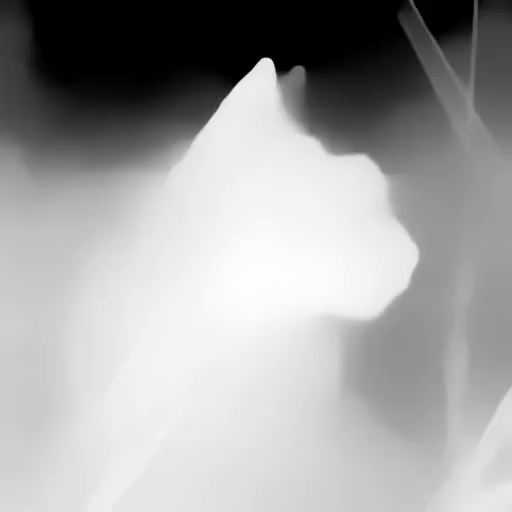

# Gen-L-Video


This repository is the official implementation of [Gen-L-Video](https://arxiv.org/abs/2212.11565).

**[Gen-L-Video: Multi-Text Conditioned Long Video Generation via Temporal Co-Denoising](https://arxiv.org/abs/2212.11565)** <br/>
[Fu-Yun Wang](https://g-u-n.github.io), [Wenshuo Chen](https://github.com/winshot-thu), [Guanglu Song](https://songguanglu.github.io/), [Han-Jia Ye](https://www.lamda.nju.edu.cn/yehj/), [Yu Liu](https://liuyu.us), [Hongsheng Li](https://www.ee.cuhk.edu.hk/~hsli/) <br/>

[](https://github.com/G-U-N/Gen-L-Video)[](https://arxiv.org/abs/2305.18264)

---

<p align="center">
  <a href="#Introduction">Introduction</a> •
  <a href="#Comparisons">Comparisons</a> •  
  <a href="#Setup">Setup</a> •
  <a href="#Results">Results</a> •  
  <a href="#Citation">Citation</a> •
  <a href="#Contact">Contact</a>
</p>

## Introduction

**TL;DR:** **A** <font color=#FF2000> ***universal***</font>  **methodology that extends short video diffusion models for efficient** <font color=#FF2000>***multi-text conditioned long video***</font>  **generation and editing.**

Current methodologies for video generation and editing, while innovative, are often confined to extremely short videos (typically **less than 24 frames**) and are **limited to a single text condition**. These constraints significantly limit their applications given that real-world videos usually consist of multiple segments, each bearing different semantic information. To address this challenge, we introduce a novel paradigm dubbed as ***Gen-L-Video*** capable of extending off-the-shelf short video diffusion models for generating and editing videos comprising **hundreds of frames** with **diverse semantic segments** ***without introducing additional training, all while preserving content consistency***.

<p align="center">
  
<br>
<em>Essentially, this procedure establishes an abstract long video generator and editor without necessitating any additional training, enabling the generation and editing of videos of any length using established short video generation and editing methodologies.</em>
</p>

## Comparisons

<table class="center">
<tr>
  <td>Method</td>
  <td>Long Video</td>
  <td>Multi-Text Conditioned</td>              
  <td>Pretraining-Free</td>
  <td>Parallel Denoising</td>
  <td>Versatile</td>
</tr>
    <tr>
  <td>Tune-A-Video</td>
  <td>❌</td>
  <td>❌</td>              
  <td>✔</td>
  <td>❌</td>
  <td>❌</td>
</tr>
    <tr>
  <td>LVDM</td>
  <td>✔</td>
  <td>❌</td>              
  <td>❌</td>
  <td>❌</td>
  <td>❌</td>
</tr>
   <tr>
  <td>NUWA-XL</td>
  <td>✔</td>
  <td>✔</td>              
  <td>❌</td>
  <td>✔</td>
  <td>❌</td>
</tr>
   <tr>
  <td>Gen-L-Video</td>
  <td>✔</td>
  <td>✔</td>              
  <td>✔</td>
  <td>✔</td>
  <td>✔</td>
</tr>
</table>

## Setup

The code will soon be open source.

## Results

#### Multi-Text Conditioned Long Video Generation


https://github.com/G-U-N/Gen-L-Video/assets/60997859/9b370894-708a-4ed2-a2ac-abfa93829ea6


This video containing clips bearing various semantic information. 


#### Long Video with Smooth Semantic Changes

All the following videos are directly generated with the pretrained Stable Diffusion weight without additional training.

<table class="center">
<tr>
  <td style="text-align:center;" colspan="4"><b>Videos with Smooth Semantic Changes</b></td>
</tr>
<tr>
  <td></td>
  <td></td>
  <td></td>   
    <td></td>   
</tr>
<tr>
  <td width=25% style="text-align:center;">"A man is boating, village." → "A man is walking by, city, sunset."</td>
  <td width=25% style="text-align:center;">"A jeep car is running on the beach, sunny.” → "a jeep car is running on the beach, night."</td>
  <td width=25% style="text-align:center;">"Lion, Grass, Rainy." → "Cat, Grass, Sun." </td>
    <td width=25% style="text-align:center;">"A man is skiing in the sea." → "A man is surfing in the snow."</td>
</tr>
</table>

#### Edit Anything in Video

All the following videos are directly generated with the pretrained Stable Diffusion weight without additional training.

<table class="center">
<tr>
  <td style="text-align:center;" colspan="4"><b>Edit Anything in Videos</b></td>
</tr>
<tr>
  <td></td>
  <td></td>
  <td></td>   
    <td></td>   
</tr>
<tr>
  <td width=25% style="text-align:center;">Source Video</td>
  <td width=25% style="text-align:center;">Mask of Sunglasses</td>
  <td width=25% style="text-align:center;">"Sunglasses" → "Pink Sunglasses" </td>
    <td width=25% style="text-align:center;">"Sunglasses" → "Cyberpunk Sunglasses with Neon Lights"</td>
</tr>
<tr>
  <td></td>
  <td></td>
  <td></td>   
    <td></td>   
</tr>
<tr>
  <td width=25% style="text-align:center;">Source Video</td>
  <td width=25% style="text-align:center;">Mask of Man</td>
  <td width=25% style="text-align:center;">"Man" → "Bat Man" </td>
    <td width=25% style="text-align:center;">"Man" → "Iron Man"</td>
</tr>
</table>

#### Controllable Video

<table class="center">
<tr>
  <td style="text-align:center;" colspan="4"><b>Controllable Video</b></td>
</tr>
<tr>
  <td></td>
  <td></td>
  <td></td>   
    <td></td>   
</tr>
<tr>
  <td width=25% style="text-align:center;">Pose Control</td>
  <td width=25% style="text-align:center;">"Iron Man is fighting in the snow."</td>
  <td width=25% style="text-align:center;">"A Van Gogh style painting of a man dancing."</td>
    <td width=25% style="text-align:center;">"A man is running in the fire."</td>
</tr>
<tr>
  <td></td>
  <td></td>
  <td></td>   
    <td></td>   
</tr>
<tr>
  <td width=25% style="text-align:center;">Depth Control</td>
  <td width=25% style="text-align:center;">"Dog in the sun.""</td>
  <td width=25% style="text-align:center;">"Tiger in the sun."</td>
    <td width=25% style="text-align:center;">"Girl in the sun."</td>
</tr>
</table>

#### Long Video Generation with Pretrained Short Video Diffusion Model

All the following videos are directly generated with the pre-trained VideoCrafter without additional training. 

<table class="center">
<tr>
  <td style="text-align:center;" colspan="4"><b>Long Video Generation with Pretrained Short Video Diffusion Model</b></td>
</tr>
<tr>
  <td></td>
  <td></td>
  <td></td>   
    <td></td>   
</tr>
<tr>
  <td width=25% style="text-align:center;"> "Astronaut riding a horse." (Isolated)</td>
  <td width=25% style="text-align:center;">"Astronaut riding a horse." (Gen-L-Video)</td>
  <td width=25% style="text-align:center;">"Astronaut riding a horse, Loving Vincent Style." (Isolated)</td>
    <td width=25% style="text-align:center;">"Astronaut riding a horse, Loving Vincent Style." (Gen-L-Video)</td>
</tr>
<tr>
  <td></td>
  <td></td>
  <td></td>   
    <td></td>   
</tr>
<tr>
  <td width=25% style="text-align:center;">"A monkey is drinking water." (Isolated)</td>
  <td width=25% style="text-align:center;">"A monkey is drinking water." (Gen-L-Video)</td>
  <td width=25% style="text-align:center;">"A car is moving on the road." (Isolated)</td>
    <td width=25% style="text-align:center;">"A car is moving on the road." (Gen-L-Video)</td>
</tr>
</table>

#### Additional Results

<table class="center">
<tr>
  <td style="text-align:center;" colspan="1"><b>Additional Results</b></td>
</tr>
<tr>
  <td></td> 
</tr>
<tr>
  <td></td> 
</tr>
<tr>
  <td width=100% style="text-align:center;"> </td>
    </tr>
<tr>
  <td></td> 
</tr>
<tr>
  <td></td> 
</tr>
<tr>
  <td></td> 
</tr>
<tr>
  <td></td> 
</tr>
</table>

## Citation

If you use any content of this repo for your work, please cite the following bib entry:
```bibtex
@misc{wang2023genlvideo,
      title={Gen-L-Video: Multi-Text to Long Video Generation via Temporal Co-Denoising}, 
      author={Fu-Yun Wang and Wenshuo Chen and Guanglu Song and Han-Jia Ye and Yu Liu and Hongsheng Li},
      year={2023},
      eprint={2305.18264},
      archivePrefix={arXiv},
      primaryClass={cs.CV}
}
```

## Contact

I welcome collaborations from individuals/institutions who share a common interest in my work. Whether you have ideas to contribute, suggestions for improvements, or would like to explore partnership opportunities, I am open to discussing any form of collaboration. Please feel free to contact the author: **Fu-Yun Wang** ([wangfuyun@smail.nju.edu.cn](mailto:wangfuyun@smail.nju.edu.cn)). Enjoy the code.
